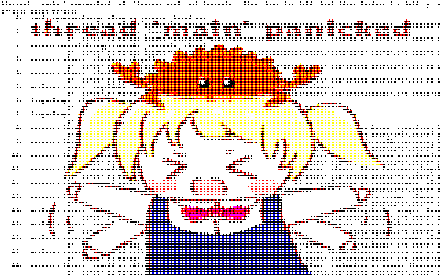

# PachImg

入力画像

<image src="./image/original.png" width="60%" max-width="640px" >

<!--  -->

出力画像



## Overview

フルカラー画像から、懐かしのPCのような3bitカラー画像へ変換する。

## Requirement

Linux(Ubuntu), Windows 11における動作を確認済み。  
プログラムにはOS依存なコードは記述していないため、他の環境でもおそらく動作する。


### 動作確認環境

| OS | CPU | MEMORY |
| :--- | :--- | :--- |
| Ubuntu 20.04 | Intel Core i9-11900 | 64GB |
| Windows 11 | AMD  | AMD Ryzen 5 5625U | 16GB |

## Usage
<!-- TODO: 名前を決める -->

ヘルプを表示する

```sh
./pachimg -h
```

画像を640x400に合うようスケールし画像を3bitカラーに変換する。(アスペクト比は維持)

```sh
./pachimg -i [file_name] 
```

出力ファイルを指定し、画像を出力する。

```sh
./pachimg -i [file_name] -o [output_file_name]
```

入力画像のサイズを維持して変換する

```sh
./pachimg -i [file_name] --original_size
```

## Installation

### From source

一般的なRustのプログラムと同様にビルド。

#### 方法1

1. 本リポジトリをクローン or ダウンロード
2. ダウンロードの場合のみ: ダウンロードしたファイルを解凍
3. clone or 解凍したディレクトリへ移動
4. clone or 解凍したディレクトリで以下のコマンドを実行

```sh
cargo build -r
```

clone or 解凍したディレクトリより`./target/release`の下に`pachimg`(windowsでは`pachimg.exe`)が生成される。

必要であれば、実行ファイルを移動し、PATHを通す。

#### 方法2

1. 本リポジトリをクローン or ダウンロード
2. ダウンロードの場合のみ: ダウンロードしたファイルを解凍
3. clone or 解凍したディレクトリへ移動
4. clone or 解凍したディレクトリで以下のコマンドを実行

```sh
cargo install --path .
```

### Windows

  windows用のインストーラ`pachimg-x.x.x-x86_64.msi`をダウンロードし、実行。

#### Uninstallation
  
  1. 「設定」より、`アプリ>インストールされているアプリ`へ移動
  2. 「pachimg」のメニューより、「アンインストール」を選択

### Linux (Ubuntu)

1. debianパッケージ`.deb`をダウンロード
2. 以下のコマンドを実行

```sh
sudo apt install pachimg_x.x.x-1_amd64.deb
```

#### Uinistallation

以下のコマンドを実行。

```sh
sudo apt remove --purge pachimg
```

## Supported image formats

PNGやJPEG等[image crate](https://docs.rs/image/latest/image/)でサポートされている画像形式。  
(webpは現在サポートしていません)

## Using lookup table

ルックアップテーブルを実行時に指定することで、LUTを用いた変換を行う。  
このリポジトリ直下`LUT/`内のファイルをダウンロードすることで、使用することができる。

また、次のようなLUTを作成することで、自由なLUTを使用することができる。

LUTは4096色のに対応する4画素の画素データで表現したものである。

    LUTのデータ構造 := [[[r, g, b];4]; 4096]

LUTの例(一部分):

```json
[
  [[0,0,0],[0,0,0],[0,0,0],[0,0,0]], // r0,g0,b0
  [[0,0,0],[0,0,0],[0,0,0],[0,0,0]], // r0,g0,b1
  [[0,0,0],[0,0,0],[0,0,0],[0,0,0]], // r0,g0,b2
  ...
```

24bitカラー(各チャンネル8bit(0-255))から4096色(12bitカラー)への変換は以下の演算で行う  
以下はRustでの辺案コードである。`x_src`が入力データである。

```rust
let (r, g, b) = (
    ((r_src as u32 * 0xF + 0x87) >> 8) as u8,
    ((g_src as u32 * 0xF + 0x87) >> 8) as u8,
    ((b_src as u32 * 0xF + 0x87) >> 8) as u8,
);
```

## License

Copyright (c) 2024 PARADISO

`pachimg` is made available under the terms of the MIT license.

See the [License](./LICENSE) files for license details.
